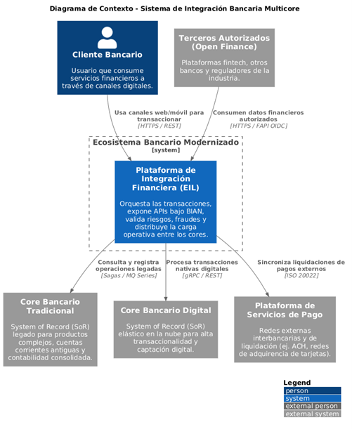

# Plataforma de Integración Bancaria Multicore (Arquitectura de Coexistencia & Modernización)

Este repositorio contiene la propuesta técnica formal para el diseño de la arquitectura de integración de un ecosistema bancario tradicional en proceso de modernización. La solución aborda de forma práctica la coexistencia de sistemas legados con tecnologías nativas en la nube, el cumplimiento regulatorio de protección de datos personales y la implementación de estándares internacionales de la industria financiera.

---

## 📄 Entregable Principal

El documento técnico consolidado con el desarrollo profundo de todas las tareas, justificaciones tecnológicas y matrices de riesgo se encuentra disponible en formato PDF en la siguiente ruta:

👉 **[Descargar Documento Técnico en PDF](./docs/SHAG%C3%91AY_LUIS_ARQUITECTURA%20DE%20INTEGRACI%C3%93N.pdf)**

---

## 🏛️ Resumen de la Solución Arquitectónica

La arquitectura ha sido diseñada bajo tres pilares fundamentales de la ingeniería de software moderna:

1. **Alineación con el Estándar BIAN (Banking Industry Architecture Network):** Aislamiento de los canales digitales (Banca Web y Móvil) mediante un _Enterprise Integration Layer (EIL)_ organizado por dominios de servicio funcionales (_Customer_, _Product_, y _Payment Execution_).
2. **Estrategia Multicore Eficiente (Patrón Strangler Fig):** Coexistencia inteligente que mantiene el **Core Tradicional (Mainframe)** como sistema de registro para carteras complejas y contabilidad de cierre, mientras el **Nuevo Core Digital (Cloud-Native)** absorbe la alta transaccionalidad de cuentas digitales y servicios de _Open Finance_.
3. **Consistencia y Resiliencia Distribuida (Event-Driven):** Implementación de transacciones distribuidas no bloqueantes mediante el patrón **Saga Orquestado**, control de duplicados mediante un componente de **Idempotencia en memoria (Redis)** y procesamiento asíncrono en tiempo real para **Prevención de Fraudes y Riesgos** utilizando un bus transaccional basado en **Apache Kafka**.

---

## 💻 Stack Tecnológico Propuesto

- **Perímetro y Enrutamiento (Baja Latencia):** Kong Enterprise API Gateway / Apigee.
- **Seguridad y Gestión de Identidad (Zero-Trust):** Keycloak (OAuth2, OpenID Connect, Perfil FAPI).
- **Malla de Servicios (Internal Mesh):** Istio (mTLS mandatorio inter-service).
- **Capa de Microservicios (BIAN Domains):** Java (Spring Boot) / Go / NestJS desplegados en AWS EKS o Azure AKS.
- **Estándar de Mensajería Financiera:** ISO 20022 (Estructura de payloads perimetrales en JSON, comunicación interna vía gRPC/ProtoBuf).
- **Bus Transaccional de Eventos:** Apache Kafka Cluster (Avro Schema Registry para gobierno de datos).
- **Base de Datos Operativa & Caché:** Supabase / PostgreSQL Distributed + Redis Cluster.

---

## 🗺️ Diagramas de Arquitectura (C4 Model)

Los componentes lógicos del sistema están estructurados bajo el estándar C4 para garantizar la visibilidad técnica en múltiples niveles. Los gráficos renderizados se despliegan a continuación:

### Nivel 1: Diagrama de Contexto

Delimita las fronteras del sistema, actores y dependencias externas (_Open Finance_, Redes de Pago).

### Nivel 2: Diagrama de Contenedores

Detalla la distribución tecnológica, la infraestructura híbrida (Cloud/On-Prem) y la interacción del Gateway con el IdP y el bus de eventos.

### Nivel 3: Diagrama de Componentes

Hace foco interno en el _Payment Services Microservice_, evidenciando los componentes de validación ISO 20022, el evaluador de idempotencia y el orquestador Saga.

---

## 🛡️ Seguridad y Cumplimiento Normativo (LODP)

- **Seguridad Financiera:** Autenticación de canales mediante _Authorization Code con PKCE_ y firmas mediante llaves privadas (_Private Key JWT_) para terceros.
- **Cumplimiento LODP:** Cifrado de datos en reposo y tránsito (AES-256 + mTLS) gestionado por _HashiCorp Vault_. Mecanismos de **Data Masking** (Enmascaramiento) y anonimización en el flujo de eventos de Kafka para proteger la Información de Identificación Personal (PII) antes de ser consumida por motores de analítica o logs de auditoría.

---

## 🚀 Estrategia de Migración Gradual

El proyecto de integración descarta el enfoque _Big Bang_ y se ejecuta en **4 fases operativas**:

1. **Fase 1:** Despliegue de infraestructura base y coexistencia pasiva.
2. **Fase 2:** Desacoplamiento de productos nativos digitales (Aislamiento de impacto).
3. **Fase 3:** Transición escalonada de canales digitales mediante la implementación de _Feature Flags_ por cohortes de usuarios (1%, 5%, 25%, 100%).
4. **Fase 4:** Migración de datos históricos de saldos, conciliación automatizada y desmantelamiento parcial del esquema heredado.

---

_Diseño y documentación técnica elaborados bajo estándares de Arquitectura de Software Financiero de grado empresarial._
